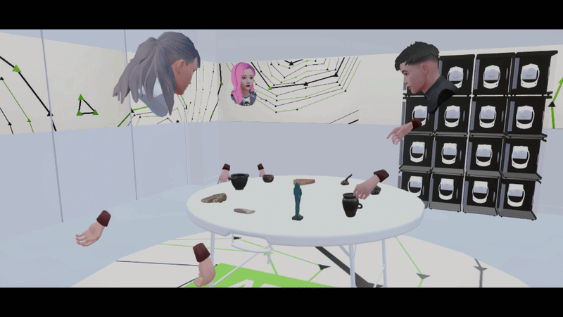

# FusionXRLab

*A hybrid XR research platform for studying social interaction across different configurations of virtual realities.*

FusionXRLab is a Unity-based research environment built with **Ubiq networking**, and **Ready Player Me** (before it was discontinued in January 2026). It enables co-located and remote participants to interact inside a shared digital twin of a physical lab space. The current working version uses default Ubiq avatars.

The system is designed for structured experimental studies, supporting synchronised object spawning, avatar tracking, spatial alignment, facilitator controls, and hybrid XR collaboration.

---

## 🎥 Demo



---

## 🚀 Core Features

- 🌍 Hybrid XR networking (co-located + remote)
- 🧍 Full-body tracked avatars
- 🪑 Networked grabbable object spawning with ownership transfer
- 🧾 Dynamic experimental prop spawning (e.g., papers)
- 🎛 Facilitator control panel (Unity Editor tools)
- 🧪 Structured experiment modes (table + object sets)
- 📊 Integrated experiment logging

---

## 🔧 Installation

### Prerequisites

- Unity **6000.1.1f1**
- Git
- Git LFS (`git lfs install`)
- Meta Quest 3 or Quest Pro
- Oculus Desktop App

---

## 🧬 Clone the Repository

```bash
git lfs install
git clone https://github.com/ross-johnstone/FusionXRLab.git
cd FusionXRLab